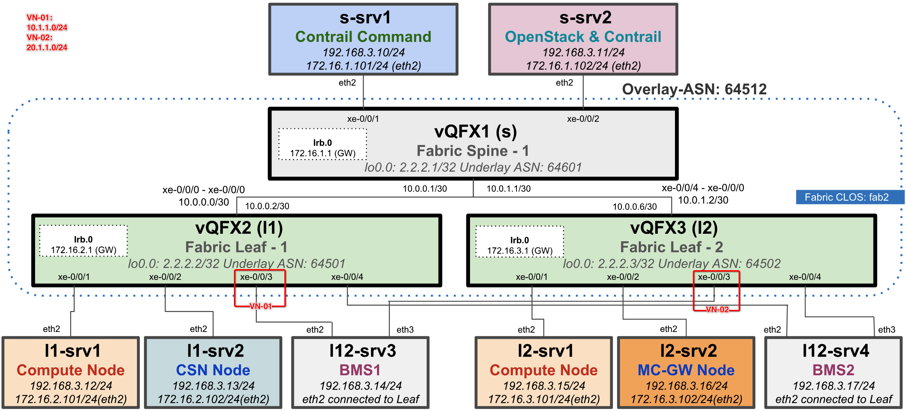
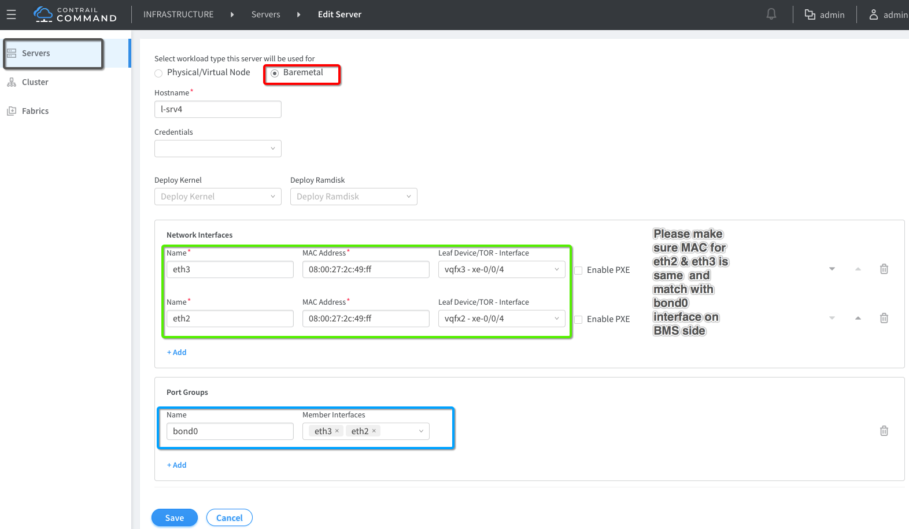

# BMS Multiple Interfaces Connection to different Leafs (TOR)

This use-case is for BMS having two interfaces connected to a separate vQFX leaf in underlay and to separate Virtual Networks VN-01 & VN-02. This use-case is only for "cem-1x2-vqfx-8srvs" topology. Here is topology high level diagram.





## 1. Add BMS server as two separate objects via Contrail Command

When BMS has two interfaces and you want to manage those two interfaces via Fabric Manager, please add each interface as a separate Server via Contrail Command GUI.

Add BMS "l12-srv3" eth2 interface




## 2. Create BMS Instances after adding the BMS servers

Add BMS "l12-srv3" eth3 interface


## Leaf Configuration verification

l12-srv3 "eth2" connection to vQFX2 xe-0/0/3

```bash
vagrant@vqfx2> show configuration interfaces xe-0/0/3 | display inheritance no-comments | display set 
set interfaces xe-0/0/3 flexible-vlan-tagging
set interfaces xe-0/0/3 native-vlan-id 4094
set interfaces xe-0/0/3 encapsulation extended-vlan-bridge
set interfaces xe-0/0/3 unit 0 vlan-id 4094

vagrant@vqfx2> show ethernet-switching table    

MAC flags (S - static MAC, D - dynamic MAC, L - locally learned, P - Persistent static
           SE - statistics enabled, NM - non configured MAC, R - remote PE MAC, O - ovsdb MAC)

Ethernet switching table : 6 entries, 6 learned
Routing instance : default-switch
   Vlan                MAC                 MAC      Logical                Active
   name                address             flags    interface              source
   contrail_VN-01-l2-4 02:21:d7:4f:82:f2   D        vtep.32769             172.16.2.101                  
   contrail_VN-01-l2-4 02:cf:fb:ea:d6:f1   D        vtep.32770             172.16.3.101                  
   contrail_VN-01-l2-4 08:00:27:2c:49:ff   D        vtep.32772             2.2.2.3                       
   contrail_VN-01-l2-4 08:00:27:6c:6e:5f   D        xe-0/0/3.0           
   default             08:00:27:1f:d9:7f   D        xe-0/0/1.0           
   default             08:00:27:c5:c1:7b   D        xe-0/0/2.0           


vagrant@vqfx2> show evpn database               
Instance: default-switch
VLAN  DomainId  MAC address        Active source                  Timestamp        IP address
     4          02:21:d7:4f:82:f2  172.16.2.101                   Sep 05 21:15:51  10.1.1.3
     4          02:cf:fb:ea:d6:f1  172.16.3.101                   Sep 05 21:15:51  10.1.1.4
     4          08:00:27:2c:49:ff  2.2.2.3                        Sep 05 22:36:07
     4          08:00:27:6c:6e:5f  xe-0/0/3.0                     Sep 06 04:33:43

 ```

l12-srv3 "eth3" connection to vQFX3 xe-0/0/3

```bash
vagrant@vqfx3> show configuration interfaces xe-0/0/3 | display inheritance no-comments | display set    
set interfaces xe-0/0/3 flexible-vlan-tagging
set interfaces xe-0/0/3 native-vlan-id 4094
set interfaces xe-0/0/3 encapsulation extended-vlan-bridge
set interfaces xe-0/0/3 unit 0 vlan-id 4094

{master:0}
vagrant@vqfx3> show ethernet-switching table                                                             

MAC flags (S - static MAC, D - dynamic MAC, L - locally learned, P - Persistent static
           SE - statistics enabled, NM - non configured MAC, R - remote PE MAC, O - ovsdb MAC)


Ethernet switching table : 5 entries, 5 learned
Routing instance : default-switch
   Vlan                MAC                 MAC      Logical                Active
   name                address             flags    interface              source
   contrail_VN-02-l2-5 02:3a:13:76:57:db   D        vtep.32769             172.16.2.101                  
   contrail_VN-02-l2-5 02:b2:26:d5:59:4e   D        vtep.32771             172.16.3.101                  
   contrail_VN-02-l2-5 08:00:27:00:4a:6c   D        xe-0/0/3.0           
   default             08:00:27:44:f6:2f   D        xe-0/0/2.0           
   default             08:00:27:b1:6b:18   D        xe-0/0/1.0           

{master:0}
vagrant@vqfx3> show evpn database                                                                        
Instance: default-switch
VLAN  DomainId  MAC address        Active source                  Timestamp        IP address
     5          02:3a:13:76:57:db  172.16.2.101                   Sep 06 04:17:12  20.1.1.3
     5          02:b2:26:d5:59:4e  172.16.3.101                   Sep 06 04:17:13  20.1.1.4
     5          08:00:27:00:4a:6c  xe-0/0/3.0                     Sep 06 04:20:29

{master:0}
 ```


## Test Traffic

Now connect to l12-srv3 "vagrant ssh l12-srv3" and use following steps to test BMS to VM ip connectivity.

```bash


pkill dhclient
dhclient bond0


[root@l12-srv4 vagrant]# ping 20.1.1.3
PING 20.1.1.3 (20.1.1.3) 56(84) bytes of data.
64 bytes from 20.1.1.3: icmp_seq=1 ttl=64 time=1161 ms
64 bytes from 20.1.1.3: icmp_seq=2 ttl=64 time=262 ms
64 bytes from 20.1.1.3: icmp_seq=3 ttl=64 time=262 ms
64 bytes from 20.1.1.3: icmp_seq=4 ttl=64 time=265 ms
^C
--- 20.1.1.3 ping statistics ---
4 packets transmitted, 4 received, 0% packet loss, time 3010ms
rtt min/avg/max/mdev = 262.435/487.974/1161.824/389.049 ms, pipe 2
[root@l12-srv4 vagrant]# cat /etc/sysconfig/network-scripts/ifcfg-eth2 
#VAGRANT-BEGIN
# The contents below are automatically generated by Vagrant. Do not modify.
NM_CONTROLLED=yes
BOOTPROTO=none
ONBOOT=yes
MASTER=bond0
SLAVE=yes
DEVICE=eth2
PEERDNS=no
#VAGRANT-END
NM_CONTROLLED=no

[root@l12-srv4 vagrant]# cat /etc/sysconfig/network-scripts/ifcfg-eth3
#VAGRANT-BEGIN
# The contents below are automatically generated by Vagrant. Do not modify.
NM_CONTROLLED=yes
BOOTPROTO=none
ONBOOT=yes
MASTER=bond0
SLAVE=yes
DEVICE=eth3
PEERDNS=no
#VAGRANT-END
NM_CONTROLLED=no

[root@l12-srv4 vagrant]# cat /etc/sysconfig/network-scripts/ifcfg-bond0 
DEVICE=bond0
NAME=bond0
TYPE=Bond
BONDING_MASTER=yes
BOOTPROTO=dhcp
ONBOOT=yes
BOOTPROTO=none
BONDING_OPTS="mode=1 miimon=100"
 ``` 


```


